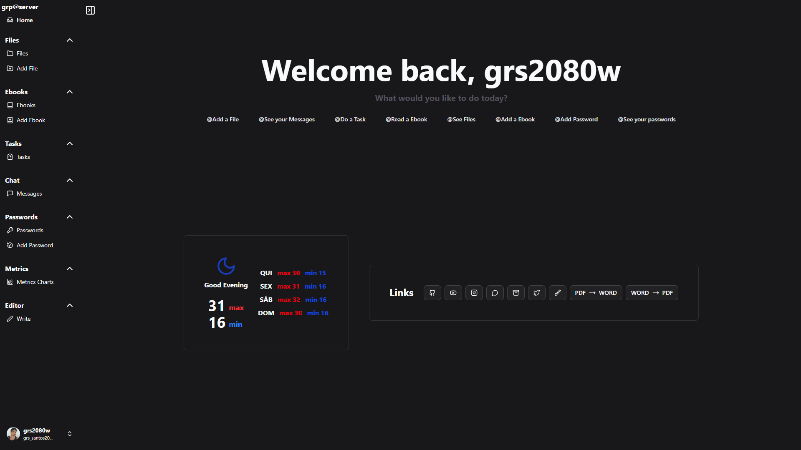

# **Grp\@Server**



> "Your personal server on-the-go, 24/7, user-centric and end-to-end!"
> We deliver full access, banking security and real-time details – pay in 12 interest-free installments (metaphorically, of course). 😎

---

## 🎯 Overview

**Grp\@Server** is your personal productivity and management hub, accessible from anywhere via browser. With a high-performance **frontend** running on Next.js and full integration with the backend, you can download/upload massive files (up to 10GB), manage tasks, ebooks, passwords (AES), WhatsApp-style chat, rich-text editor, customizable tables and much more. All this in a domain that sticks in your memory: `grp.dev.br`.

**Why Grp\@Server?**

* **Scalability**: Supports huge files without breaking.

* **Banking Security**: AES-level encryption and OTP for super-auth.

* **User-centric**: UX designed for developers, power users, and stakeholders.

* **Analytics 360**: Interactive charts in Recharts for on-the-fly insights.

---

## 🛠️ Key Features

1. **Authentication and Access**

* End-to-end middleware for route protection.

* Cookies + JWT for robust session control.

* Dedicated routes: Login, Signup, Reset Password, OTP (2FA), Admin/Secret.

2. **User Management**

* Full CRUD in `/account`.

* Real-time onboarding and profile management.

3. **Dashboard & Metrics**

* Dynamic charts with Recharts: number of files per domain, sizes, usage statistics.

4. **File Management**

* Upload/Download up to 10GB (Next.js config).

* Inline preview (images, PDFs) + version history.

5. **Content Editor**

* Integrated TinyMCE for inline rich text.

* Export to PDF with one click – complete workflow.

6. **Instant Chat**

* WhatsApp-style channel to remind important messages.

7. **E-book Library**

* Upload/List PDFs and ePubs.

* First page preview and metadata navigation.

8. **Task Management**

* Simple and intuitive CRUD tasks.

* Kanban-lite for fast workflow.

9. **Password Manager**

* CRUD credentials with bank AES.

* On-demand password generator with customizable parameters.

10. **Notifications**

* Toasts with shadcn/ui and Toaster for every touchpoint.

11. **UI and Navigation**

* Responsive sidebar, theme switcher, and import aliases.

12. **Infrastructure and Architecture**

* Next.js 14, Tailwind CSS, TypeScript, modular framework.

* API services, reusable utilities, optimized configuration (images, routing).

13. **Fallback pages**

* Custom `loading.tsx` and `not-found.tsx` for seamless UX.

14. **Integrated API**

* Route API inside Next.js for RESTful handlers and OTP microservices in Python.

---

## 📁 Project Structure

```

source/
└── application/
├── (routes)/
│ ├── signal/
│ │ ├── create/ # Registration routes
│ │ ├── login/ # Login routes
│ │ ├── master/ # Master/admin routes
│ │ ├── otp/ # OTP authentication routes
│ │ ├── reset/ # Password reset routes
│ │ └── secret/ # Protected secret pages
│ └── home/
│ ├── account/ # User management
│ ├── chat/ # Chat module
│ ├── e-books/ # E-book library
│ ├── editor/ # TinyMCE editor
│ ├── files/ # File upload/download
│ ├── metrics/ # Metrics dashboard
│ ├── passwords/ # Password manager
│ └── tasks/ # Task manager
├── components/ # Reusable UI components
├── services/ # Integration with APIs and business logic
├── utilities/ # Utility functions
├── hooks/ # React custom hooks
├── layout.tsx # Main layout
├── page.tsx # Root route entry
├── loading.tsx # Global loading page
├── not-found.tsx # Custom 404 page
├── middleware.ts # Authentication control via Middleware
└── globals.css # Global styles (Tailwind)

| public/ # Static assets (icons, images)
```

---

## 🔗 Read also

To learn more about the backend server (API, OTP microservices in Python, business logic and much more), check out the repository:

https://github.com/Grs2080w/grp_server.git

---

## 🙌 See you soon!

It's worth checking out the Grp@Server Frontend! If you liked it, leave a ⭐, open an issue or send a PR. We'll keep collaborating and keeping the flow going — because devs never stop evolving! 🚀